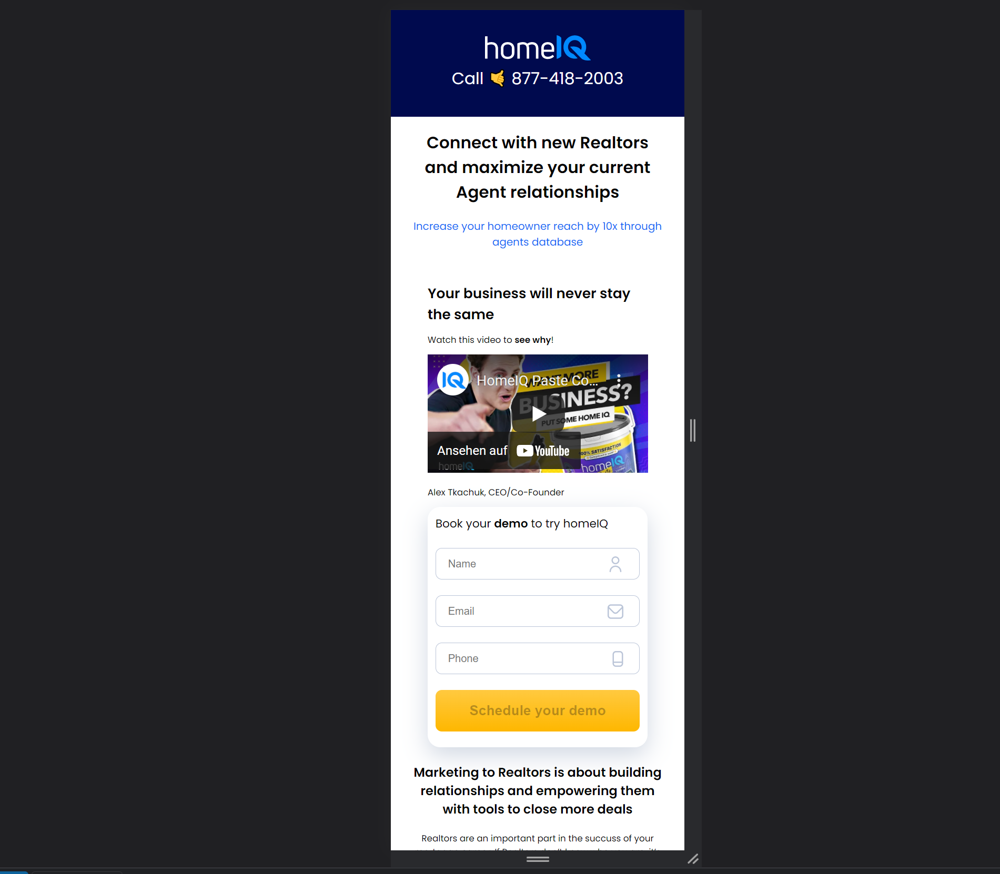
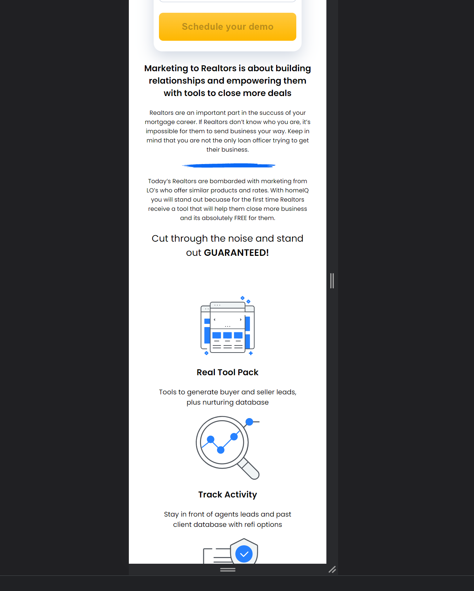
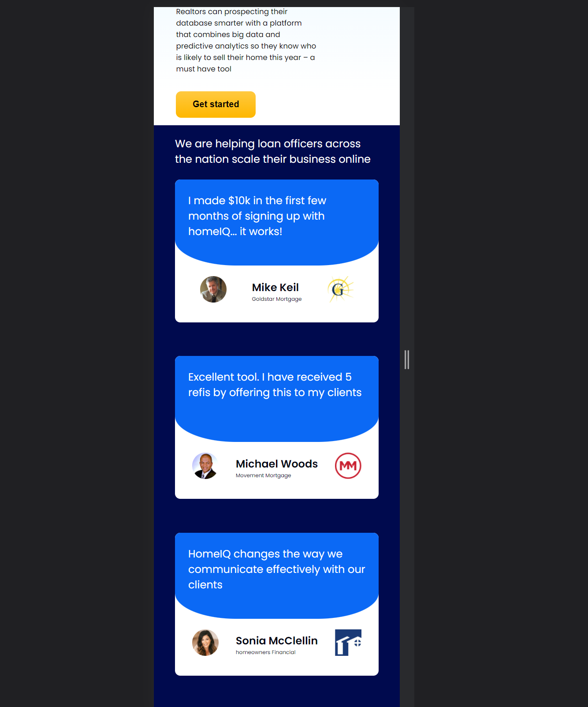

# SoaFront

This project was generated with [Angular CLI](https://github.com/angular/angular-cli) version 13.1.2.

## Development server

Run `ng serve` for a dev server. Navigate to `http://localhost:4200/`. The app will automatically reload if you change any of the source files.

Run `npm run server` for a json.server. 

## General description

The structure of project: 

Main component with its styles,
Form component with its styles,
Form service with apiUrl 'http://localhost:5000/creds'

There were used Reactive Forms of Angular as well as their built-in validation through Validators Module.

Styles everywhere are in scss, written in related units, that makes easier to implement responsive ui. 

Here are some screen of mobile version

